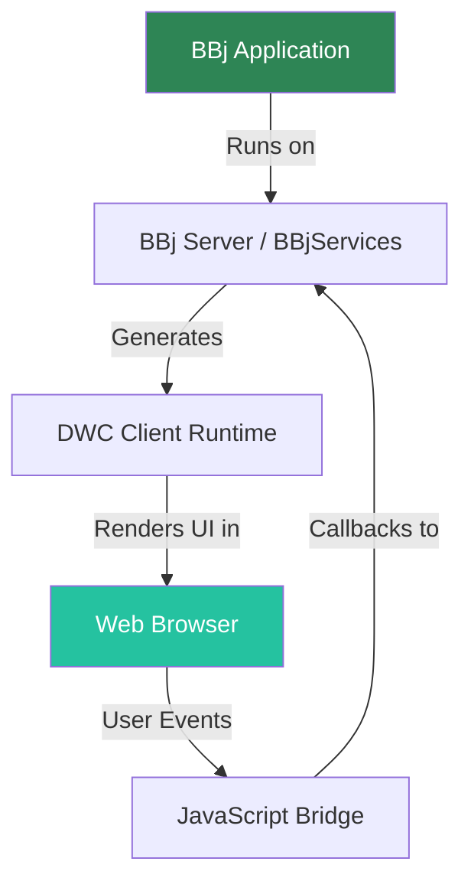

<objective>
Install and configure all Phase 2 plugins (local search, Mermaid diagrams, ideal-image optimization, zooming lightbox) and verify zero-config features (copy button, BBj syntax highlighting).

Purpose: This plan establishes the plugin foundation that the image migration plan (02-02) depends on. It also delivers three immediately usable features: full-text search, Mermaid diagrams, and the copy button verification.

Output: A fully configured `docusaurus.config.ts` with all plugins registered, a working search bar with keyboard shortcut, a Mermaid example diagram in the DWC Overview chapter, and confirmed copy-button functionality.
</objective>

<execution_context>
@/Users/beff/.claude/get-shit-done/workflows/execute-plan.md
@/Users/beff/.claude/get-shit-done/templates/summary.md
</execution_context>

<context>
@.planning/PROJECT.md
@.planning/ROADMAP.md
@.planning/STATE.md
@.planning/phases/02-search-visual-tooling/02-CONTEXT.md
@.planning/phases/02-search-visual-tooling/02-RESEARCH.md
@docusaurus.config.ts
@package.json
</context>

<tasks>

<task type="auto">
  <name>Task 1: Install plugins and configure docusaurus.config.ts</name>
  <files>package.json, docusaurus.config.ts</files>
  <action>
Install all four npm packages in a single command:
```bash
npm install @docusaurus/theme-mermaid@3.9.2 @docusaurus/plugin-ideal-image@3.9.2 @easyops-cn/docusaurus-search-local docusaurus-plugin-zooming
```

Then update `docusaurus.config.ts` with the following changes (merge into existing config, do NOT replace existing settings):

1. Add `markdown.mermaid: true` to the existing `markdown` block (alongside the existing `hooks` property):
```typescript
markdown: {
  mermaid: true,
  hooks: {
    onBrokenMarkdownLinks: 'warn',
  },
},
```

2. Add a top-level `themes` array with Mermaid theme and local search:
```typescript
themes: [
  '@docusaurus/theme-mermaid',
  [
    require.resolve("@easyops-cn/docusaurus-search-local"),
    {
      hashed: true,
      indexDocs: true,
      indexBlog: false,
      indexPages: false,
      docsRouteBasePath: "/",
      searchResultLimits: 8,
      searchResultContextMaxLength: 50,
      searchBarShortcut: true,
      searchBarShortcutKeymap: "mod+k",
    },
  ],
],
```

3. Add a top-level `plugins` array with ideal-image and zooming:
```typescript
plugins: [
  [
    '@docusaurus/plugin-ideal-image',
    {
      quality: 85,
      max: 1030,
      min: 640,
      steps: 2,
      disableInDev: false,
    },
  ],
  'docusaurus-plugin-zooming',
],
```

4. Add `mermaid` and `zooming` to the existing `themeConfig` object (inside the existing themeConfig, alongside navbar, footer, prism, etc.):
```typescript
mermaid: {
  theme: {
    light: 'neutral',
    dark: 'dark',
  },
},
zooming: {
  selector: '.markdown img',
  delay: 500,
  background: {
    light: 'rgba(101,108,133,0.8)',
    dark: 'rgba(9,10,17,0.8)',
  },
  options: {
    enableGrab: false,
  },
},
```

IMPORTANT: The `docsRouteBasePath: "/"` MUST match the existing `routeBasePath: '/'` in the preset docs config. Do NOT change `routeBasePath`.

IMPORTANT: Do NOT remove the `satisfies Preset.ThemeConfig` type assertion on themeConfig. The Mermaid and zooming config keys are not in the Preset.ThemeConfig type -- you may need to cast themeConfig with `as any` or use a broader type to avoid TypeScript errors. Check if `npm run typecheck` passes after the edit. If it fails on themeConfig typing, use a type assertion approach that satisfies the compiler while preserving the config structure.
  </action>
  <verify>
Run these commands in sequence:
1. `npm run typecheck` -- must pass with zero errors
2. `npm run build` -- must complete successfully
3. Verify `node_modules/@docusaurus/theme-mermaid/package.json` exists
4. Verify `node_modules/@docusaurus/plugin-ideal-image/package.json` exists
5. Verify `node_modules/@easyops-cn/docusaurus-search-local/package.json` exists
  </verify>
  <done>
All four plugins are installed and registered in docusaurus.config.ts. TypeScript typecheck passes. Build completes without errors. The config has: markdown.mermaid = true, themes array with Mermaid + search, plugins array with ideal-image + zooming, themeConfig with mermaid themes and zooming delay.
  </done>
</task>

<task type="auto">
  <name>Task 2: Add Mermaid example diagram and verify copy button</name>
  <files>docs/03-dwc-overview/index.md</files>
  <action>
Add a Mermaid diagram to `docs/03-dwc-overview/index.md` (the DWC Overview chapter). This is the most appropriate location because it introduces the DWC architecture to learners.

Find a suitable location in the document where the DWC architecture is being explained (likely near the top, after the introductory text). Add a Mermaid diagram that illustrates the DWC runtime architecture -- how BBj application code runs on the server, generates the DWC runtime, which renders in the browser, with user events flowing back through a JavaScript bridge.

Example diagram (adapt to fit the chapter's actual content and terminology):
````markdown

````

Read the chapter first to understand its content and place the diagram where it adds the most value. If the chapter discusses the DWC architecture flow, place the diagram there. If not, adapt the diagram content to match what the chapter actually covers.

For copy button verification: The copy button is enabled by default in Docusaurus `@docusaurus/theme-classic`. No configuration is needed. Simply confirm that `themeConfig.prism` exists in the config (it does) and that no explicit `magicComments` or `additionalLanguages` settings have disabled the copy button. The verification step will confirm it works visually.
  </action>
  <verify>
1. `npm run build` completes successfully (Mermaid diagram compiles)
2. Grep the modified doc file for the mermaid code fence: `grep -c 'mermaid' docs/03-dwc-overview/index.md` returns at least 1
3. `npm run typecheck` still passes
  </verify>
  <done>
A Mermaid diagram illustrating the DWC architecture is present in the DWC Overview chapter. The diagram uses the mermaid code fence syntax and will render as a visual diagram with theme-aware colors (neutral for light mode, dark for dark mode). Copy button is confirmed as default-enabled (no config change needed).
  </done>
</task>

</tasks>

<verification>
After both tasks complete:

1. **Build check:** `npm run build` succeeds with no errors
2. **Type check:** `npm run typecheck` passes
3. **Search presence:** Build output includes search index files (look for `search-index` in the build directory)
4. **Mermaid compilation:** No mermaid-related warnings in build output
5. **Plugin registration:** `docusaurus.config.ts` contains all four plugin/theme registrations

Note: Local search only produces results in production builds (`npm run serve`), NOT in dev server (`npm start`). The search bar will appear in dev but return no results -- this is expected per the plugin's design (search index is generated at build time).
</verification>

<success_criteria>
- All four npm packages installed and listed in package.json dependencies
- docusaurus.config.ts has: markdown.mermaid = true, themes array with 2 entries, plugins array with 2 entries, themeConfig.mermaid and themeConfig.zooming
- Mermaid diagram present in DWC Overview chapter (docs/03-dwc-overview/index.md)
- `npm run build` and `npm run typecheck` both pass
- Copy button requires no changes (already default-enabled)
</success_criteria>

<output>
After completion, create `.planning/phases/02-search-visual-tooling/02-01-SUMMARY.md`
</output>
