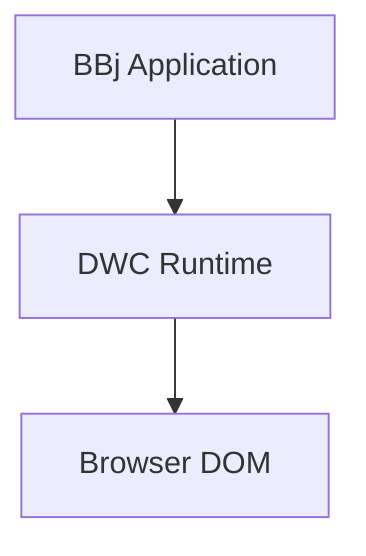
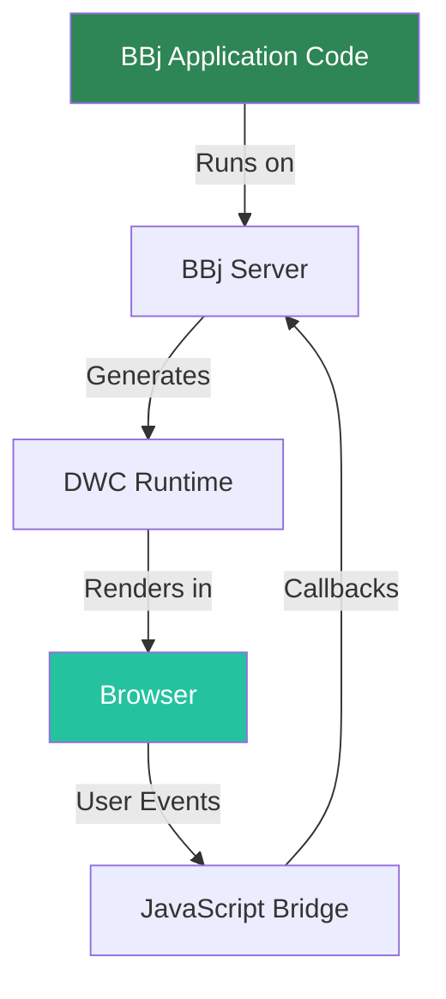

# Phase 2: Search & Visual Tooling - Research

**Researched:** 2026-01-31
**Domain:** Docusaurus 3.9.2 plugin ecosystem -- search, diagrams, image optimization, code blocks
**Confidence:** HIGH (all findings verified against official Docusaurus docs or authoritative GitHub sources)

## Summary

This phase adds four capabilities to the Docusaurus site: full-text search, Mermaid diagrams, responsive image optimization, and code block copy buttons. All four are plugin/config-level changes with no custom code required except for the image migration (which requires converting 48 Markdown image references across 9 files to JSX `<Image>` components).

The copy button is already enabled by default in Docusaurus -- no configuration needed (VIS-02 is essentially free). Mermaid and search are straightforward plugin installs. The image optimization migration is the largest task: ideal-image requires `<Image img={require('...')} />` JSX syntax, which means converting every `` reference. GIF files (4 total) and SVG files (7 total) cannot be processed by ideal-image and must remain as standard Markdown images.

A critical compatibility issue exists between `@docusaurus/plugin-ideal-image` and medium-zoom-based lightbox plugins. The zoom plugins initialize before ideal-image finishes lazy-loading, causing either no zoom or double-zoom bugs. The recommended lightbox plugin (`docusaurus-plugin-zooming`) has a configurable `delay` option that may mitigate this, but this interaction needs validation during implementation.

**Primary recommendation:** Install all four features in one pass. Start with the zero-config wins (copy button verification, Mermaid), then search, then tackle ideal-image + lightbox last since it has the most risk and the largest file-change footprint.

## Standard Stack

### Core
| Library | Version | Purpose | Why Standard |
|---------|---------|---------|--------------|
| `@docusaurus/theme-mermaid` | 3.9.2 | Mermaid diagram rendering in Markdown | Official Docusaurus package, auto-matches site version |
| `@docusaurus/plugin-ideal-image` | 3.9.2 | Responsive image optimization with blur-up placeholders | Official Docusaurus package, webpack-integrated |
| `@easyops-cn/docusaurus-search-local` | 0.52.3 | Local full-text search (Algolia fallback) | Most actively maintained local search, 0.52.3 released 2026-01-29, explicit Docusaurus v3 support |
| `docusaurus-plugin-zooming` | latest | Click-to-zoom lightbox for images | Built for Docusaurus 3 specifically, has `delay` option for lazy-loaded image compatibility |

### Supporting
| Library | Version | Purpose | When to Use |
|---------|---------|---------|-------------|
| `@docusaurus/theme-search-algolia` | (bundled) | Algolia DocSearch integration | If/when Algolia DocSearch application is approved (bundled in preset-classic) |

### Alternatives Considered
| Instead of | Could Use | Tradeoff |
|------------|-----------|----------|
| `@easyops-cn/docusaurus-search-local` | `@cmfcmf/docusaurus-search-local` v2.0.1 | cmfcmf is also Docusaurus v3 compatible but has fewer configuration options (no explicit keyboard shortcut config). easyops-cn has `searchBarShortcutKeymap` for Cmd+K |
| `@easyops-cn/docusaurus-search-local` | Algolia DocSearch (free tier) | Algolia is the gold standard but requires application approval. BBj training content is borderline -- Algolia free tier requires "open-source project documentation or technical blogs." A commercial training course may be rejected. Local search works immediately with no external dependency |
| `docusaurus-plugin-zooming` | `docusaurus-plugin-image-zoom` v3.0.1 | image-zoom is more popular (2,478 weekly downloads) but has a documented open bug with ideal-image (GitHub issue #6, still unresolved). zooming is less proven but designed for Docusaurus 3 and has `delay` option that may handle lazy-loaded images |
| `@docusaurus/plugin-ideal-image` | Standard Markdown images (no plugin) | Ideal-image adds responsive sizing and blur-up but requires converting all 48 image references from `` to `<Image img={require('path')} />`. If the ROI is not worth the migration effort, standard images with just a zoom plugin would work |

**Installation:**
```bash
npm install @docusaurus/theme-mermaid@3.9.2 @docusaurus/plugin-ideal-image@3.9.2 @easyops-cn/docusaurus-search-local docusaurus-plugin-zooming
```

## Architecture Patterns

### Recommended Configuration Structure

All changes go into `docusaurus.config.ts`. No new files or components need to be created (except potentially an MDX component override for convenience).

```
docusaurus.config.ts   # All plugin registrations and themeConfig changes
docs/**/*.md           # Image syntax migration (9 files, 48 references)
```

### Pattern 1: Search Configuration (Local-First with Algolia Upgrade Path)
**What:** Configure local search immediately, document Algolia config for future swap
**When to use:** When Algolia approval is uncertain or pending

```typescript
// docusaurus.config.ts
// Source: https://github.com/easyops-cn/docusaurus-search-local
const config: Config = {
  themes: [
    [
      require.resolve("@easyops-cn/docusaurus-search-local"),
      {
        hashed: true,
        indexDocs: true,
        indexBlog: false,      // blog is disabled
        indexPages: false,
        docsRouteBasePath: "/", // docs are at root
        searchResultLimits: 8,
        searchResultContextMaxLength: 50,
        searchBarShortcut: true,
        searchBarShortcutKeymap: "mod+k", // Cmd+K on Mac, Ctrl+K elsewhere
      },
    ],
  ],
};
```

**Future Algolia swap** (when/if approved):
```typescript
// Replace the themes entry above with this themeConfig block:
themeConfig: {
  algolia: {
    appId: 'YOUR_APP_ID',
    apiKey: 'YOUR_SEARCH_API_KEY',
    indexName: 'YOUR_INDEX_NAME',
    contextualSearch: true, // SRCH-04: i18n future-proofing
    searchPagePath: 'search',
  },
}
```

### Pattern 2: Mermaid Diagram Configuration
**What:** Enable Mermaid with theme-aware colors
**When to use:** Always -- this is the standard Docusaurus pattern

```typescript
// docusaurus.config.ts
// Source: https://docusaurus.io/docs/markdown-features/diagrams
const config: Config = {
  markdown: {
    mermaid: true,
  },
  themes: ['@docusaurus/theme-mermaid'],
  themeConfig: {
    mermaid: {
      theme: {
        light: 'neutral',
        dark: 'dark',
      },
    },
  },
};
```

Usage in Markdown:
````markdown

````

### Pattern 3: Ideal-Image with Zooming
**What:** Configure responsive images with click-to-zoom
**When to use:** For PNG/JPG images that benefit from responsive sizing

```typescript
// docusaurus.config.ts
// Source: https://docusaurus.io/docs/api/plugins/@docusaurus/plugin-ideal-image
const config: Config = {
  plugins: [
    [
      '@docusaurus/plugin-ideal-image',
      {
        quality: 85,
        max: 1030,  // max resized width
        min: 640,   // min resized width
        steps: 2,   // generate 2 sizes between min and max
        disableInDev: false, // enable in dev for testing
      },
    ],
    'docusaurus-plugin-zooming',
  ],
  themeConfig: {
    zooming: {
      selector: '.markdown img',
      delay: 500, // wait for ideal-image lazy load
      background: {
        light: 'rgba(101,108,133,0.8)',
        dark: 'rgba(9,10,17,0.8)',
      },
      options: {
        enableGrab: false,
      },
    },
  },
};
```

### Pattern 4: Image Migration Syntax
**What:** Convert standard Markdown images to IdealImage components
**When to use:** For every PNG/JPG image reference in docs

Before (current):
```markdown

```

After (migrated):
```mdx
import Image from '@theme/IdealImage';

<Image img={require('@site/static/img/CSSFlexbox.png')} alt="CSS Flexbox" />
```

**Exception** -- GIF and SVG files stay as Markdown images (ideal-image only supports PNG/JPG):
```markdown

```

### Anti-Patterns to Avoid
- **Renaming .md to .mdx for image migration:** Not necessary. Docusaurus processes all `.md` files through MDX, so JSX imports work in `.md` files too
- **Using absolute `/img/path.png` in ideal-image require():** Must use `@site/static/img/path.png` or relative paths. Absolute paths bypass webpack and ideal-image won't process them
- **Initializing zoom before images load:** The zoom plugin must handle lazy-loaded images -- use `delay` option or MutationObserver pattern
- **Applying ideal-image to GIFs:** Plugin only supports PNG and JPG. GIFs and SVGs must stay as standard images

## Don't Hand-Roll

| Problem | Don't Build | Use Instead | Why |
|---------|-------------|-------------|-----|
| Full-text search | Custom search with lunr.js | `@easyops-cn/docusaurus-search-local` | Handles index generation, search UI, keyboard shortcuts, result context snippets, route awareness |
| Responsive images | Custom webpack loader + `<picture>` elements | `@docusaurus/plugin-ideal-image` | Generates multiple sizes, handles blur-up placeholders, integrates with Docusaurus build |
| Image lightbox | Custom modal with zoom logic | `docusaurus-plugin-zooming` | Handles overlay, animation, keyboard dismiss, dark mode backgrounds |
| Mermaid rendering | Embedding mermaid.js directly | `@docusaurus/theme-mermaid` | Auto-integrates with Docusaurus build, SSR-compatible, theme-aware |
| Copy button | Custom clipboard.js integration | Built-in (Docusaurus default) | Already enabled on all code blocks in `@docusaurus/theme-classic` |

**Key insight:** Every feature in this phase has an official or well-maintained plugin. The only "custom work" is the syntactic migration of image references from Markdown to JSX.

## Common Pitfalls

### Pitfall 1: Ideal-Image + Zoom Plugin Timing Conflict
**What goes wrong:** Images lazy-loaded by ideal-image appear after the zoom plugin initializes. Result: clicking images does nothing, or produces double-zoom artifacts.
**Why it happens:** Medium-zoom captures `` elements at page load. Ideal-image replaces placeholder divs with `` tags after the viewport scrolls to them.
**How to avoid:** Use `docusaurus-plugin-zooming` with `delay: 500` (or higher). If that fails, the fallback is a custom `MutationObserver` that re-initializes zoom when the DOM changes. Test with a page that has many images (e.g., Chapter 8 - Control Validation with 13 images).
**Warning signs:** Images are not zoomable on first load but become zoomable after navigating away and back.

### Pitfall 2: Ideal-Image Only Supports PNG and JPG
**What goes wrong:** GIF animations or SVG graphics break or disappear when wrapped in `<Image>` component.
**Why it happens:** Ideal-image uses sharp/webpack loaders that only process raster formats (PNG, JPG). GIF and SVG are not supported.
**How to avoid:** Inventory all images first. Keep GIF (4 files) and SVG (7 files) as standard Markdown `` syntax. Only migrate PNG/JPG to `<Image>`.
**Warning signs:** Build errors mentioning unsupported file types, or images rendering as broken.

### Pitfall 3: Image Paths Must Use require() or import
**What goes wrong:** Using `<Image img="/img/CSSFlexbox.png" />` passes a string path instead of a webpack-resolved module. The image renders but without any optimization (no responsive sizes, no blur-up).
**Why it happens:** Ideal-image's webpack loader only activates on `require()` or `import` statements. String paths bypass webpack entirely.
**How to avoid:** Always use `<Image img={require('@site/static/img/CSSFlexbox.png')} />` or ES import syntax.
**Warning signs:** Images render but DevTools show no `srcset` attribute and no blur-up placeholder.

### Pitfall 4: Local Search Only Works in Production Build
**What goes wrong:** Search bar appears but returns no results during `npm start` (dev server).
**Why it happens:** `@easyops-cn/docusaurus-search-local` generates the search index at build time. The dev server does not run a full build.
**How to avoid:** Test search with `npm run build && npm run serve`. Document this in the verification steps.
**Warning signs:** Search works after `npm run serve` but not during `npm start`.

### Pitfall 5: Algolia DocSearch Free Tier Rejection
**What goes wrong:** Algolia application is rejected because the site is a commercial training course, not open-source documentation.
**Why it happens:** Algolia DocSearch free tier requires "open-source project documentation pages or technical blogs." A BBj DWC training course may not qualify.
**How to avoid:** Implement local search first as the primary solution. Treat Algolia as an optional upgrade. If applying, emphasize the open-source nature of the DWC framework itself.
**Warning signs:** Application sits in review for weeks with no response, or receives a rejection email.

### Pitfall 6: docsRouteBasePath Mismatch
**What goes wrong:** Local search indexes blog or page routes instead of docs, or doesn't find any content.
**Why it happens:** This site uses `routeBasePath: '/'` (docs at root). The search plugin must be configured with `docsRouteBasePath: '/'` to match.
**How to avoid:** Ensure the search plugin's `docsRouteBasePath` matches the preset's `docs.routeBasePath`.
**Warning signs:** Search returns zero results for terms that clearly exist in the docs.

## Code Examples

### Complete docusaurus.config.ts Changes (Verified Pattern)

```typescript
// Source: Official Docusaurus docs + plugin READMEs
import {themes as prismThemes} from 'prism-react-renderer';
import type {Config} from '@docusaurus/types';
import type * as Preset from '@docusaurus/preset-classic';

const config: Config = {
  // ... existing config ...

  // ADD: Enable Mermaid Markdown processing
  markdown: {
    mermaid: true,
    hooks: {
      onBrokenMarkdownLinks: 'warn',
    },
  },

  // ADD: Mermaid theme + local search
  themes: [
    '@docusaurus/theme-mermaid',
    [
      require.resolve("@easyops-cn/docusaurus-search-local"),
      {
        hashed: true,
        indexDocs: true,
        indexBlog: false,
        indexPages: false,
        docsRouteBasePath: "/",
        searchResultLimits: 8,
        searchResultContextMaxLength: 50,
        searchBarShortcut: true,
        searchBarShortcutKeymap: "mod+k",
      },
    ],
  ],

  // MODIFY: Add plugins array
  plugins: [
    [
      '@docusaurus/plugin-ideal-image',
      {
        quality: 85,
        max: 1030,
        min: 640,
        steps: 2,
        disableInDev: false,
      },
    ],
    'docusaurus-plugin-zooming',
  ],

  themeConfig: {
    // ... existing themeConfig ...

    // ADD: Mermaid theme config
    mermaid: {
      theme: {
        light: 'neutral',
        dark: 'dark',
      },
    },

    // ADD: Zooming config
    zooming: {
      selector: '.markdown img',
      delay: 500,
      background: {
        light: 'rgba(101,108,133,0.8)',
        dark: 'rgba(9,10,17,0.8)',
      },
      options: {
        enableGrab: false,
      },
    },
  } satisfies Preset.ThemeConfig,
};
```

### Image Migration Example (Single File)

```markdown
<!-- BEFORE: docs/06-flow-layouts/index.md -->

```

```mdx
<!-- AFTER: docs/06-flow-layouts/index.md -->
import Image from '@theme/IdealImage';

<Image img={require('@site/static/img/CSSFlexbox.png')} alt="CSS Flexbox" />
```

Note: The `import` statement goes at the top of the file (after the frontmatter). One `import` per file is sufficient for all `<Image>` components in that file.

### Mermaid Diagram Example (for DWC Architecture Chapter)

```markdown

```

## State of the Art

| Old Approach | Current Approach | When Changed | Impact |
|--------------|------------------|--------------|--------|
| Algolia DocSearch only | Local search plugins as first-class alternatives | Docusaurus 2.x+ | No dependency on external service approval |
| Manual mermaid.js include | `@docusaurus/theme-mermaid` official package | Docusaurus 2.2+ | Zero-config Mermaid with SSR support |
| No image optimization | `@docusaurus/plugin-ideal-image` | Docusaurus 2.0+ | Responsive images with blur-up, but requires JSX syntax |
| Custom copy button | Built-in copy button | Docusaurus 2.0+ | No configuration needed, enabled by default |

**Deprecated/outdated:**
- `algoliaOptions` config key: Renamed to `searchParameters` in Docusaurus 2+. Use `searchParameters` in `themeConfig.algolia`
- `prism-react-renderer` v1: This project already uses v2 (^2.3.0), which is correct for Docusaurus 3

## Open Questions

1. **Zoom + Ideal-Image compatibility**
   - What we know: There is a documented incompatibility (GitHub issue #6 on docusaurus-plugin-image-zoom). The `docusaurus-plugin-zooming` plugin has a `delay` option that may help.
   - What's unclear: Whether `delay: 500` is sufficient, or if a MutationObserver workaround will be needed. No one has publicly confirmed `docusaurus-plugin-zooming` works cleanly with ideal-image.
   - Recommendation: Implement with `delay: 500`, test thoroughly. If zoom fails on lazy-loaded images, either increase the delay, add a custom MutationObserver, or drop ideal-image and use standard images with zoom only.

2. **Algolia DocSearch eligibility**
   - What we know: Free tier requires "open-source documentation or technical blogs." The BBj DWC is a product of BASIS International, and this is a training course.
   - What's unclear: Whether Algolia considers DWC documentation as qualifying open-source content, since DWC itself has open-source components.
   - Recommendation: Don't block on Algolia. Implement local search. Apply to Algolia in parallel. If approved, swap in the Algolia config (it's a themeConfig change, no code changes needed).

3. **Image migration scope vs. value**
   - What we know: 48 image references across 9 files need conversion. 4 GIFs and referenced SVGs must remain unconverted. The migration is mechanical but touches many files.
   - What's unclear: Whether the responsive sizing benefit justifies the migration effort for a documentation site where most images are UI screenshots at fixed sizes.
   - Recommendation: Proceed with migration as planned (CONTEXT.md says "full migration, not partial"). The blur-up placeholders and lazy loading provide real UX improvement for image-heavy chapters like Chapter 8 (13 images).

## Sources

### Primary (HIGH confidence)
- Docusaurus official docs -- search configuration: https://docusaurus.io/docs/search
- Docusaurus official docs -- Mermaid diagrams: https://docusaurus.io/docs/markdown-features/diagrams
- Docusaurus official docs -- plugin-ideal-image: https://docusaurus.io/docs/api/plugins/@docusaurus/plugin-ideal-image
- Docusaurus official docs -- code blocks: https://docusaurus.io/docs/markdown-features/code-blocks
- Docusaurus official docs -- assets and image handling: https://docusaurus.io/docs/markdown-features/assets
- PrismJS BBj language support commit: https://github.com/PrismJS/prism/commit/1134bdfc

### Secondary (MEDIUM confidence)
- `@easyops-cn/docusaurus-search-local` README (v0.52.3): https://github.com/easyops-cn/docusaurus-search-local
- `docusaurus-plugin-zooming` README: https://github.com/inovector/docusaurus-plugin-zooming
- `docusaurus-plugin-image-zoom` issue #6 (ideal-image incompatibility): https://github.com/gabrielcsapo/docusaurus-plugin-image-zoom/issues/6
- Docusaurus discussion #9885 (ideal-image in Markdown): https://github.com/facebook/docusaurus/discussions/9885
- Algolia DocSearch eligibility: https://docsearch.algolia.com/docs/who-can-apply/

### Tertiary (LOW confidence)
- `docusaurus-plugin-zooming` delay-based compatibility with ideal-image: Inferred from plugin design, not publicly confirmed by users

## Metadata

**Confidence breakdown:**
- Standard stack: HIGH -- All packages verified against official Docusaurus docs and plugin repositories
- Architecture: HIGH -- Configuration patterns taken directly from official docs and verified READMEs
- Pitfalls: HIGH for ideal-image/zoom conflict (documented GitHub issue); MEDIUM for Algolia eligibility (based on published criteria); HIGH for all others (documented in official sources)

**Research date:** 2026-01-31
**Valid until:** 2026-03-01 (Docusaurus 3.9.2 is current stable; plugins are actively maintained)

### Current Project State (for planner reference)
- **Docusaurus version:** 3.9.2
- **React version:** ^19.0.0
- **Existing Prism languages:** java, bash, bbj (BBj is officially in Prism, confirmed working)
- **Total images to migrate:** 48 PNG/JPG references across 9 doc files
- **Images to exclude from migration:** 4 GIFs (Validation_demo.gif, Validation_demo2.gif, Validation_demo3.gif, DTColorCodeCompletion.gif), 7 SVGs
- **Heaviest image file:** Chapter 8 (Control Validation) with 13 image references
- **Copy button:** Already enabled by default -- verification only, no configuration needed
- **Blog:** Disabled (indexBlog: false for search)
- **Docs route:** Root (`/`) -- search plugin docsRouteBasePath must be `"/"`
