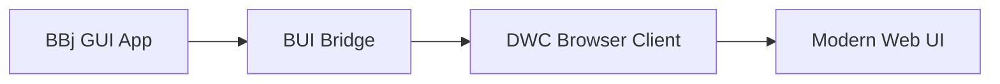

# Enhancement Stack Research

**Research Date:** 2026-01-31
**Researcher:** Claude Opus 4.5
**Scope:** Stack recommendations for enhancing a Docusaurus 3.9.2 documentation/training site with search, AI chat, video, i18n, showcase, and visual enhancement capabilities.

**Baseline:** Docusaurus 3.9.2, React 19, TypeScript 5.6, GitHub Pages (static-only), no backend budget. See `.planning/codebase/STACK.md` for full current stack.

> **Version Verification Note:** Web search was unavailable during this research session. All version numbers are based on knowledge current to May 2025. Items marked with `[VERIFY]` should be checked against npm/official docs before implementation. The Docusaurus 3.x ecosystem is stable and these recommendations are high-confidence, but exact patch versions should be confirmed.

---

## 1. Search: Algolia DocSearch

### Recommendation

**@docusaurus/theme-search-algolia 3.9.2** (match Docusaurus version)

**Confidence:** Very High (95%)

### Why This

- Docusaurus has first-party Algolia integration -- it is the officially recommended search solution.
- Sister site docs.webforj.com already uses Algolia DocSearch, proving the pattern works in this organization.
- DocSearch is free for open-source/developer documentation sites (apply at docsearch.algolia.com).
- Zero backend required -- Algolia hosts the index, crawler runs on their infrastructure.
- The `@docusaurus/theme-search-algolia` package ships with `@docusaurus/preset-classic` and only needs configuration to activate.

### How It Works

1. Apply for free DocSearch program (requires public docs site, open-source or developer-focused).
2. Algolia provides `appId`, `apiKey` (search-only), and `indexName`.
3. Add to `docusaurus.config.ts` under `themeConfig.algolia`.
4. Algolia's crawler indexes the site automatically on a schedule.
5. Search UI appears in the navbar with keyboard shortcut (Ctrl/Cmd+K).

### Configuration

```typescript
// docusaurus.config.ts - themeConfig addition
algolia: {
  appId: 'YOUR_APP_ID',
  apiKey: 'YOUR_SEARCH_API_KEY', // search-only, safe to commit
  indexName: 'dwc-course',
  contextualSearch: true, // scope results to current locale/version
  searchPagePath: 'search',
},
```

### What NOT to Use

| Alternative | Why Not |
|---|---|
| **@easyops-cn/docusaurus-search-local** | Decent local search plugin, but index grows with content size, increases bundle, and search quality is significantly lower than Algolia. Not worth it when DocSearch is free. |
| **Typesense DocSearch** | Good open-source alternative, but requires self-hosted Typesense server -- violates the no-backend constraint. |
| **Lunr.js / FlexSearch** | Client-side indexing. Poor search quality for technical documentation. Index file bloats the static bundle. |
| **Meilisearch** | Requires self-hosted server. Not viable for GitHub Pages. |
| **Built-in Docusaurus search** | Does not exist. Docusaurus has no built-in search; it delegates to plugins. |

### Effort Estimate

- **Implementation:** 1-2 hours (config change + DocSearch application)
- **Wait time:** DocSearch applications typically take 1-2 weeks for approval
- **Fallback:** If DocSearch application is rejected (unlikely for developer training), self-run Algolia crawler with free tier (10k records/month).

### Dependencies

- None additional. `@docusaurus/theme-search-algolia` is already available via `@docusaurus/preset-classic`.

### Risk

Low. This is the most well-trodden path in the Docusaurus ecosystem.

---

## 2. AI Chat Assistant

### Recommendation

**Custom React component using the Anthropic Messages API (Claude) via client-side fetch**

With fallback/alternative: **Inkeep** (hosted AI docs assistant, has Docusaurus plugin)

**Confidence:** Moderate-High (75%)

### Why This Approach

The constraint is critical: must work on a static site with no backend, and must be budget-conscious. This eliminates most "AI chatbot as a service" platforms that charge per-conversation.

**Option A: Custom Claude-powered chat component (Recommended)**

- Build a lightweight React chat component that calls the Anthropic API directly from the client.
- Pre-process all course content into a context document at build time (Docusaurus plugin or build script).
- Use Claude's large context window to include relevant course content with each request.
- API key management: use a restricted API key with spend limits, exposed client-side (acceptable for a training site with limited traffic; add rate limiting via Anthropic's API settings).
- Cost: ~$0.01-0.05 per conversation. For a training site with modest traffic, this is effectively free (<$10/month even with heavy use).

**Option B: Inkeep (Alternative if budget allows ~$100/month)**

- Inkeep provides a hosted AI assistant purpose-built for documentation sites.
- Has an official Docusaurus integration.
- Automatically indexes your docs content.
- No API key exposure concern (they handle the AI backend).
- `[VERIFY]` Check current Inkeep pricing -- they had a free tier for small sites as of early 2025.

### Architecture for Option A

```
Build time:
  docs/*.md  -->  build script  -->  context.json (all docs concatenated/chunked)

Runtime:
  User question + context.json  -->  Anthropic API  -->  Streamed response
```

### Key Libraries

| Library | Purpose | Version |
|---|---|---|
| `react-markdown` | Render AI markdown responses | `^9.0.0` `[VERIFY]` |
| `remark-gfm` | GitHub-flavored markdown in responses | `^4.0.0` `[VERIFY]` |
| Custom component | Chat UI with slide-out panel | N/A (build from scratch) |

### What NOT to Use

| Alternative | Why Not |
|---|---|
| **ChatGPT Widget / OpenAI Assistants** | Requires OpenAI Assistants API with server-side session management. More complex than direct API call. Higher cost per conversation. |
| **Mendable** | Acquired/pivoted. Documentation AI space is volatile. |
| **Kapa.ai** | Enterprise pricing ($500+/month). Overkill for a training site. |
| **LangChain.js in browser** | Massive bundle size. Over-engineered for a simple Q&A use case. RAG in-browser is fragile and slow. |
| **Local LLM (WebLLM/Ollama)** | Requires user hardware. Terrible UX. Not production-ready for general users. |
| **Docusaurus Chat Plugin (community)** | No mature, maintained community plugin exists for this. |

### Effort Estimate

- **Option A (Custom):** 2-3 days (chat component, build-time indexing, API integration, styling)
- **Option B (Inkeep):** 2-4 hours (install plugin, configure, done)

### Dependencies for Option A

```json
{
  "react-markdown": "^9.0.0",
  "remark-gfm": "^4.0.0"
}
```

Plus a build-time script (Node.js, no new deps) to generate the context document.

### Risk

- **API key exposure:** Moderate risk. Mitigate with Anthropic API spend limits and rate limiting. For a niche training site, abuse is unlikely.
- **API availability:** If Anthropic API is down, chat is unavailable. Add graceful degradation (show "Chat unavailable" message).
- **Context size:** 12 chapters of training content fits well within Claude's context window. No chunking/RAG needed.

---

## 3. Video Embedding: Synthesia

### Recommendation

**Standard iframe embedding with a custom `<SynthesiaVideo />` React component**

**Confidence:** Very High (95%)

### Why This

Synthesia provides embed codes for all videos. The approach is straightforward:

1. Create videos in Synthesia (team already has license).
2. Get the embed URL for each video.
3. Embed via a reusable React component that handles responsive sizing, loading states, and accessibility.

### Component Design

```typescript
// src/components/SynthesiaVideo/index.tsx
type SynthesiaVideoProps = {
  videoId: string;
  title: string;
  lang?: 'en' | 'fr' | 'es' | 'de';
  aspectRatio?: '16:9' | '9:16';
};
```

The component wraps the Synthesia iframe with:
- Responsive container (CSS aspect-ratio)
- Loading skeleton
- Language selector if multi-language variants exist
- `title` attribute for accessibility
- Lazy loading (`loading="lazy"`)

### Synthesia Embed URL Format

```
https://share.synthesia.io/embeds/videos/{VIDEO_ID}
```

`[VERIFY]` Confirm current embed URL format from Synthesia dashboard. The format above was standard as of early 2025.

### What NOT to Use

| Alternative | Why Not |
|---|---|
| **Synthesia API for dynamic generation** | Overkill. Videos are pre-produced. No need for runtime generation. |
| **Download and self-host MP4** | Loses Synthesia analytics. Large files bloat GitHub repo. GitHub Pages has soft size limits. |
| **YouTube/Vimeo as intermediary** | Adds unnecessary platform dependency. Synthesia's native embed works fine. |
| **`<video>` tag with direct URL** | Synthesia doesn't provide direct MP4 URLs for sharing. Embed iframe is the supported method. |

### Effort Estimate

- **Component:** 2-3 hours (build component, add styles, test responsive behavior)
- **Per-video integration:** 5-10 minutes each (add component to markdown page with video ID)
- **Video production:** Separate effort (Synthesia screenplay writing + rendering)

### Dependencies

None. Pure React component with standard HTML iframe.

### Data Management

Create a video manifest for managing all Synthesia videos:

```typescript
// src/data/videos.ts
export const videos: Record<string, {
  id: string;
  title: string;
  chapter: number;
  duration: string;
  languages: string[];
}> = {
  'ch01-intro': {
    id: 'abc123',
    title: 'Introduction to DWC',
    chapter: 1,
    duration: '3:45',
    languages: ['en', 'de', 'fr', 'es'],
  },
  // ...
};
```

### Risk

Low. Iframe embedding is the most standard web pattern. Only risk is Synthesia changing their embed URL format (unlikely without deprecation notice).

---

## 4. Internationalization (i18n)

### Recommendation

**Docusaurus built-in i18n** (filesystem-based) + **AI-assisted translation via Claude API or translation script**

**Confidence:** Very High (95%) for i18n framework, High (85%) for AI translation workflow

### Why This

Docusaurus has first-party i18n support. It is deeply integrated into the framework -- routing, navbar locale dropdown, content organization, and build are all handled automatically. There is no reason to use anything else.

### How Docusaurus i18n Works

1. Configure locales in `docusaurus.config.ts`.
2. Run `npm run write-translations` to generate translation JSON files.
3. Translated docs go in `i18n/{locale}/docusaurus-plugin-content-docs/current/` mirroring the `docs/` structure.
4. Each locale builds as a separate static site (e.g., `/fr/`, `/es/`, `/de/`).
5. Locale dropdown appears in navbar automatically.

### Configuration

```typescript
// docusaurus.config.ts
i18n: {
  defaultLocale: 'en',
  locales: ['en', 'fr', 'es', 'de'],
  localeConfigs: {
    en: { label: 'English', direction: 'ltr', htmlLang: 'en-US' },
    fr: { label: 'Francais', direction: 'ltr', htmlLang: 'fr-FR' },
    es: { label: 'Espanol', direction: 'ltr', htmlLang: 'es-ES' },
    de: { label: 'Deutsch', direction: 'ltr', htmlLang: 'de-DE' },
  },
},
```

Add locale dropdown to navbar:

```typescript
// navbar.items
{ type: 'localeDropdown', position: 'right' },
```

### AI-Assisted Translation Workflow

**Recommended approach: Build-time translation script**

1. Write a Node.js script (`scripts/translate.ts`) that:
   - Reads all English `.md` files from `docs/`.
   - Sends content to Claude API with translation prompt (preserving Markdown structure, frontmatter, code blocks, component references).
   - Writes translated files to `i18n/{locale}/docusaurus-plugin-content-docs/current/`.
2. Run manually when content changes: `npx tsx scripts/translate.ts --locale fr`.
3. Human review of translations before committing.
4. Store translated content in git (Docusaurus requires this).

**Translation prompt considerations:**
- Preserve all Markdown formatting, links, code blocks, and frontmatter.
- Keep technical terms (BBj, DWC, BUI, etc.) untranslated.
- Maintain code examples in English (standard practice for developer docs).
- Translate UI strings, headings, explanatory text.

### What NOT to Use

| Alternative | Why Not |
|---|---|
| **Crowdin** | Excellent tool, but adds SaaS dependency and complexity. For 3 target languages with AI-assisted translation, a script is simpler and cheaper. Crowdin is worth it if you have a community of human translators -- this project does not. |
| **Transifex / Weblate** | Same reasoning as Crowdin. Over-engineered for AI-generated translations of a training course. |
| **Google Translate API** | Lower quality than LLM-based translation for technical content. Does not understand context, code blocks, or Markdown structure well. |
| **DeepL API** | Better than Google Translate but still inferior to Claude for preserving document structure and technical terminology. Also costs money per character. |
| **i18next / react-intl** | These are React i18n libraries for runtime translation. Docusaurus has its own i18n system. Using these would fight the framework. |
| **Runtime translation (client-side)** | Terrible UX (flash of untranslated content), SEO-invisible, unreliable. Docusaurus i18n generates static pages per locale. |

### Build Impact

Each locale roughly doubles the build output. With 4 locales:
- Build time: ~4x longer (acceptable for GitHub Actions)
- Deploy size: ~4x larger (acceptable for GitHub Pages)
- GitHub Pages has no hard storage limit for public repos

### Effort Estimate

- **i18n configuration:** 1-2 hours
- **Translation script:** 4-6 hours (with proper Markdown-aware chunking and prompt engineering)
- **Initial translation of 12 chapters:** ~$5-15 in API costs per language
- **Human review per language:** 2-4 hours per language (domain expert)
- **Total per language:** ~1 day including review

### Dependencies

```json
{
  "@anthropic-ai/sdk": "^0.39.0"
}
```

`[VERIFY]` Check latest Anthropic SDK version. Only needed as a dev dependency for the translation script, not shipped to users.

### Risk

- **Translation quality:** AI translations are good but not perfect. Technical training content needs human review, especially for domain-specific BBj terminology. Budget 2-4 hours of expert review per language.
- **Maintenance burden:** Every content change needs re-translation. The script should support incremental translation (only translate changed files).
- **Build time:** 4 locale builds could take 5-10 minutes. Not a problem for CI but annoying for local development. Use `--locale en` during dev.

---

## 5. Showcase / Gallery Pages

### Recommendation

**Custom Docusaurus pages with React components** (no plugin needed)

**Confidence:** Very High (95%)

### Why This

Docusaurus supports custom pages in `src/pages/`. A showcase/gallery is a standard React component page -- there is no need for a plugin or external library.

### Architecture

```
src/
  pages/
    showcase.tsx          # Gallery page component
  components/
    ShowcaseGallery/
      index.tsx           # Gallery grid component
      styles.module.css   # Gallery styles
      ShowcaseCard.tsx     # Individual card component
  data/
    showcase.ts           # Showcase items data
```

### Data Structure

```typescript
// src/data/showcase.ts
export type ShowcaseItem = {
  title: string;
  description: string;
  thumbnail: string;       // path to screenshot image
  tags: string[];          // e.g., ['grid', 'responsive', 'dashboard']
  demoUrl?: string;        // live demo link
  sourceUrl?: string;      // GitHub repo link
  highlights: string[];    // key features demonstrated
};

export const showcaseItems: ShowcaseItem[] = [
  // ...
];
```

### Features to Include

- **Tag-based filtering** (client-side, no backend needed)
- **Search within gallery** (simple string match, no Algolia needed for small dataset)
- **Lightbox for screenshots** (use `react-medium-image-zoom` or similar)
- **Responsive grid layout** (CSS Grid, no library needed)

### Reference Pattern

Docusaurus itself has a showcase page (docusaurus.io/showcase). The pattern is well-documented and the source code is available in the Docusaurus GitHub repo. Follow their data-driven approach.

### What NOT to Use

| Alternative | Why Not |
|---|---|
| **Docusaurus blog for showcase** | Blog is disabled and not the right abstraction for a gallery. |
| **External gallery service** | Adds dependency, breaks static-site model. |
| **MDX page with hardcoded items** | Not maintainable. Data should be separate from presentation. |
| **Storybook** | For component development, not end-user showcase. Different purpose entirely. |

### Effort Estimate

- **Page + components:** 4-6 hours
- **Data population:** Depends on number of showcase items (30 min per item for screenshots + descriptions)
- **Tag filtering:** 1-2 hours

### Dependencies

```json
{
  "react-medium-image-zoom": "^5.2.0"
}
```

`[VERIFY]` Check latest version. This is optional -- could use a CSS-only lightbox approach instead.

### Risk

Very low. Standard React component development within Docusaurus conventions.

---

## 6. Enhanced Visuals: Diagrams and Code Examples

### Recommendation

**Mermaid for diagrams** (Docusaurus theme plugin) + **Enhanced code blocks** (Docusaurus built-in features)

**Confidence:** Very High (95%)

### Diagrams: Mermaid

**@docusaurus/theme-mermaid** (ships with Docusaurus, just needs enabling)

Mermaid is the standard for diagrams in Markdown-based documentation:
- Renders in the browser from text descriptions (no image files to manage).
- Supports flowcharts, sequence diagrams, class diagrams, state diagrams, ER diagrams, and more.
- Dark mode support built in.
- Already part of the Docusaurus ecosystem -- no external dependency.

**Configuration:**

```typescript
// docusaurus.config.ts
const config: Config = {
  markdown: {
    mermaid: true,
  },
  themes: ['@docusaurus/theme-mermaid'],
  // ...
};
```

**Usage in Markdown:**

````markdown

````

### Code Examples: Built-in Docusaurus Features

Docusaurus already supports these code block features (just need to be used in content):

| Feature | Syntax | Purpose |
|---|---|---|
| **Line highlighting** | `{1,3-5}` after language | Highlight specific lines in code blocks |
| **Title** | `title="filename.bbj"` | Show filename above code block |
| **Line numbers** | `showLineNumbers` | Display line numbers |
| **Tabs** | `<Tabs>` component | Show same example in multiple languages |
| **Live code** | `@docusaurus/theme-live-codeblocks` | Interactive code editing (React only) |

### Additional Visual Tools

| Tool | Package | Purpose | Confidence |
|---|---|---|---|
| **Mermaid** | `@docusaurus/theme-mermaid` | Architecture diagrams, flowcharts | 95% |
| **Docusaurus Tabs** | Built-in (`@theme/Tabs`) | Multi-language code examples | 95% |
| **Admonitions** | Built-in | Tips, warnings, info boxes | 95% |
| **react-medium-image-zoom** | `react-medium-image-zoom@^5.2.0` | Zoomable screenshots | 85% `[VERIFY]` |
| **Docusaurus Ideal Image** | `@docusaurus/plugin-ideal-image` | Responsive image optimization | 90% |

### What NOT to Use

| Alternative | Why Not |
|---|---|
| **D2 / Graphviz** | Require server-side rendering or CLI tooling. Not browser-native. Mermaid covers all needed diagram types. |
| **Excalidraw** | Great for hand-drawn style, but adds large bundle (~500KB). Overkill for technical architecture diagrams. Consider only if hand-drawn aesthetic is specifically desired. |
| **draw.io / Lucidchart exports** | Static images that cannot be maintained as code. Lose dark-mode adaptability. Mermaid diagrams are text-based and version-controlled. |
| **PlantUML** | Requires server-side rendering. Java dependency. Mermaid is the modern replacement. |
| **@docusaurus/theme-live-codeblocks** | Only works with React/JSX. BBj code cannot be live-edited in browser. Not useful for this project. |
| **Shiki (syntax highlighter)** | Docusaurus uses Prism. Switching highlighters is a major change for marginal benefit. The custom BBj language support already works with Prism. |

### Image Optimization

**@docusaurus/plugin-ideal-image** optimizes images at build time:

```typescript
// docusaurus.config.ts
plugins: [
  ['@docusaurus/plugin-ideal-image', {
    quality: 70,
    max: 1030,
    min: 640,
    steps: 2,
    disableInDev: false,
  }],
],
```

This addresses the concern noted in `.planning/codebase/CONCERNS.md` about large static PNG assets.

### Effort Estimate

- **Mermaid setup:** 30 minutes (config change)
- **Creating diagrams:** 1-2 hours per chapter (depends on content complexity)
- **Enhanced code blocks:** 30 min per chapter (add titles, line highlights to existing blocks)
- **Image optimization plugin:** 1 hour setup
- **Zoomable images component:** 2 hours

### Dependencies

```json
{
  "@docusaurus/theme-mermaid": "3.9.2",
  "@docusaurus/plugin-ideal-image": "3.9.2",
  "react-medium-image-zoom": "^5.2.0"
}
```

`[VERIFY]` Ensure `@docusaurus/theme-mermaid` and `@docusaurus/plugin-ideal-image` versions match the installed Docusaurus 3.9.2.

### Risk

Very low. Mermaid and ideal-image are officially maintained Docusaurus packages.

---

## Complete Dependency Summary

### New Production Dependencies

| Package | Version | Purpose | Size Impact |
|---|---|---|---|
| `@docusaurus/theme-mermaid` | `3.9.2` | Diagram rendering in Markdown | ~200KB (mermaid.js) |
| `@docusaurus/plugin-ideal-image` | `3.9.2` | Image optimization at build time | Minimal (build-time only) |
| `react-markdown` | `^9.0.0` `[VERIFY]` | Render AI chat responses | ~30KB |
| `remark-gfm` | `^4.0.0` `[VERIFY]` | GFM support in chat responses | ~5KB |
| `react-medium-image-zoom` | `^5.2.0` `[VERIFY]` | Zoomable images in showcase/docs | ~10KB |

### New Dev Dependencies

| Package | Version | Purpose |
|---|---|---|
| `@anthropic-ai/sdk` | `^0.39.0` `[VERIFY]` | Translation script (build-time only) |

### No New Dependencies Required

| Feature | Why No Deps |
|---|---|
| Algolia DocSearch | Already included in `@docusaurus/preset-classic` |
| Synthesia video | Standard HTML iframe, custom React component |
| i18n framework | Built into Docusaurus core |
| Showcase gallery | Custom React components + CSS Grid |
| Code block enhancements | Built into Docusaurus |
| Admonitions | Built into Docusaurus |

### Total Bundle Impact Estimate

- **Mermaid:** +200KB gzipped (loaded on-demand for pages with diagrams)
- **AI Chat:** +50KB (custom component + react-markdown, lazy-loaded)
- **Image zoom:** +10KB
- **Everything else:** Near-zero (config changes, iframes, built-in features)
- **Total additional JS:** ~260KB (acceptable for a documentation site, all lazy-loaded)

---

## Implementation Priority Order

Based on effort vs. impact, dependencies between features, and the project constraints:

| Priority | Feature | Effort | Impact | Rationale |
|---|---|---|---|---|
| 1 | Algolia DocSearch | 1-2 hrs | Very High | Instant usability improvement. Apply early (2-week approval wait). No code dependency. |
| 2 | Mermaid diagrams | 30 min setup | High | Config-only change. Unlocks all diagram work going forward. |
| 3 | Enhanced code blocks | Per-chapter | High | No setup needed -- use existing Docusaurus features in content. |
| 4 | Synthesia video component | 2-3 hrs | High | Simple component. Unblocks video content work (separate effort). |
| 5 | Showcase gallery | 1-2 days | Medium-High | Self-contained feature. Visible "wow factor" for stakeholders. |
| 6 | i18n configuration | 1-2 hrs | High | Config-only. Unlocks translation work. |
| 7 | AI translation script | 4-6 hrs | High | Depends on i18n config (#6). Generates content for 3 languages. |
| 8 | AI chat assistant | 2-3 days | Medium-High | Most complex feature. Build last when content is stable. |
| 9 | Image optimization | 1 hr | Medium | Performance improvement. Do after all images are added. |

---

## Configuration Compatibility Check

### Existing Config Impacts

The current `docusaurus.config.ts` has:

- `future: { v4: true }` -- This enables Docusaurus v4 compatibility mode. All recommended packages are compatible with this flag. Mermaid theme, Algolia search, and i18n all work with `future.v4`.
- `i18n: { defaultLocale: 'en', locales: ['en'] }` -- Already has the i18n key. Just needs locale expansion.
- `presets: [['classic', { ... }]]` -- Algolia config goes into `themeConfig`, not preset options. No conflict.
- `blog: false` -- No impact on any recommended features.
- `routeBasePath: '/'` -- i18n will create `/fr/`, `/es/`, `/de/` prefixed paths. No conflict.

### GitHub Pages Compatibility

All recommended features work with GitHub Pages static hosting:
- Algolia: Client-side search, index hosted by Algolia.
- AI Chat: Client-side API calls to Anthropic.
- Synthesia: External iframe embeds.
- i18n: Multiple static builds, one per locale.
- Mermaid: Client-side rendering.
- Showcase: Static React components.

### Build System Compatibility

- GitHub Actions workflow needs no changes for most features.
- i18n will require building all locales: `docusaurus build` handles this automatically when locales are configured.
- Build time will increase ~4x with 4 locales. GitHub Actions free tier allows 2000 minutes/month -- this is sufficient.

---

## Decisions Requiring Stakeholder Input

| Decision | Options | Recommendation | Who Decides |
|---|---|---|---|
| AI Chat API key exposure | (A) Expose restricted key client-side, (B) Use Inkeep hosted service, (C) Skip AI chat | A for budget reasons, B if budget allows ~$100/month | Product owner |
| Translation review process | (A) AI-only, (B) AI + human review, (C) Professional translation | B -- AI draft + domain expert review | Content team |
| Showcase content source | (A) Internal BASIS demos only, (B) Community submissions | A initially, expand later | Product owner |
| Algolia: DocSearch free vs. paid | (A) Apply for free DocSearch, (B) Self-run crawler on free tier | A first, B as fallback | Engineering |

---

## Version Verification Checklist

Before implementation, verify these versions against npm/official docs:

- [ ] `@docusaurus/theme-search-algolia` -- should match 3.9.2
- [ ] `@docusaurus/theme-mermaid` -- should match 3.9.2
- [ ] `@docusaurus/plugin-ideal-image` -- should match 3.9.2
- [ ] `react-markdown` -- check latest v9.x
- [ ] `remark-gfm` -- check latest v4.x
- [ ] `react-medium-image-zoom` -- check latest v5.x
- [ ] `@anthropic-ai/sdk` -- check latest version (fast-moving)
- [ ] Synthesia embed URL format -- confirm from Synthesia dashboard
- [ ] Inkeep pricing/availability -- check if still viable alternative

---

*Research completed: 2026-01-31*
*Researcher: Claude Opus 4.5*
*Confidence: High overall. Individual confidence levels noted per section.*
