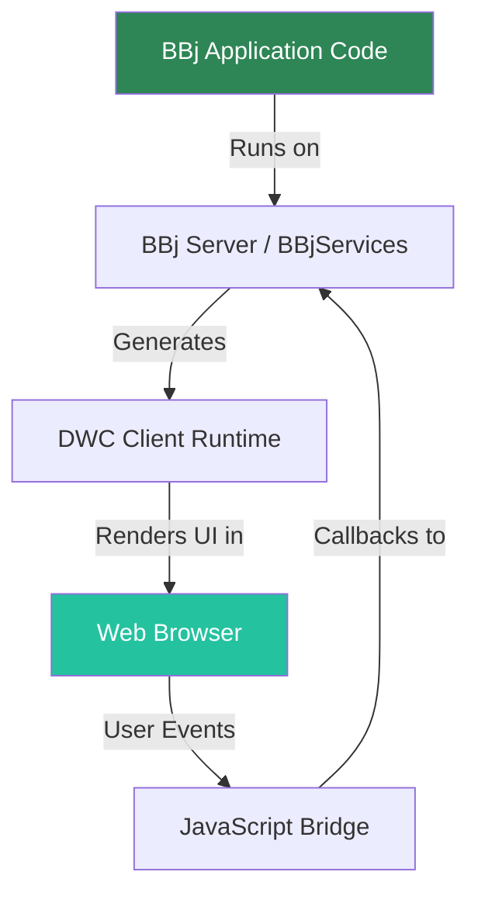

# GUI to BUI to DWC

This chapter covers the fundamentals of transitioning from BBj GUI applications to Browser User Interface (BUI) and the Dynamic Web Client (DWC).

## How the DWC Works

The diagram below shows how a BBj application runs in the DWC. Your BBj code executes on the server, which generates the DWC runtime. The runtime renders the UI in the user's web browser, and user interactions flow back to the server through a JavaScript bridge.

## Concepts Covered in This Chapter

- Registering and launching BBj GUI apps in the BUI and DWC clients using Eclipse and Enterprise Manager
- Using the `INFO(3,6)` to identify the client
- Using BBjSysGui constants with the BBj message box
- Specifying custom DWC modes with the BBj message box
- Running a complete graphical BBj app in the thin client (GUI), the Browser User Interface (BUI), and the Dynamic Web Client (DWC)
- Changing the window to use flow layout, ignoring the x, y, width, and height parameters, and then applying a CSS Grid layout strategy
- Setting attributes on a BBjButton to affect its size and appearance
- Making your app look and act like a real web app instead of a desktop app running in the browser
- Handling runtime errors in the browser's Developer Tools console

## Sections

- [Registering and Launching a DWC App](/gui-to-bui-to-dwc/registering-launching)
- [Running a "Hello World" App in BUI and DWC](/gui-to-bui-to-dwc/hello-world)
- [Taking an App From GUI to BUI to DWC](/gui-to-bui-to-dwc/gui-to-bui-to-dwc)
